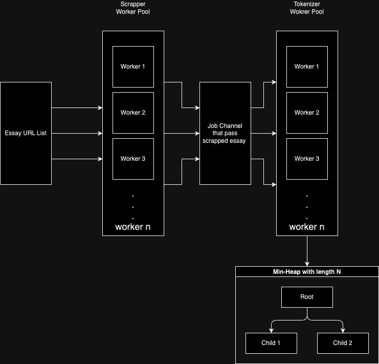

# Essay Word Counter
[](https://github.com/joshy-joy/essay-word-counter/actions/workflows/build.yml)
[](https://github.com/joshy-joy/essay-word-counter/actions/workflows/test.yml)

A Golang-based project to scrape essays from websites, process the content, and provide a detailed analysis of word frequencies. This project leverages concurrency, exponential backoff retries, and a custom min-heap to efficiently handle and analyze large amounts of text data.

## Table of Contents
- [Overview](#overview)
- [Features](#features)
- [Architecture](#architecture)
- [Installation](#installation)
- [Usage](#usage)
- [Configuration](#configuration)
- [Tests](#tests)
- [Technologies Used](#technologies-used)
- [Project Structure](#project-structure)

## Overview

The **Essay Word Counter** project is designed to:
- Scrape content from a list of URLs.
- Extract meaningful text from web pages.
- Tokenize the text and perform word frequency analysis.
- Display the top N most frequent words based on user-configurable settings.

## Features

- **Web Scraping**: Collects content from URLs using concurrent workers.
- **Word Frequency Analysis**: Analyzes and ranks the frequency of words.
- **Customizable**: Easily modify the number of workers, URL sources, and analysis criteria.
- **Error Handling**: Uses exponential backoff for reliable scraping.
- **Concurrency**: Implements worker pools for both scraping and word processing.
- **Data Persistence**: Supports JSON formatting for output data.

## Installation

## Installation

To install and run this project, follow these steps:

1. **Clone the repository**:
   ```bash
   git clone https://github.com/joshy-joy/essay-word-counter.git
   cd essay-word-counter

2. **Install dependencies**: Ensure you have Go installed (version 1.16+)::

   ```bash
   go mod tidy

3. **Run the project**:

    ```bash
    go run main.go

3. **Build the project**:

    ```bash
    go build main.go

## Usage
1. **Configure the project**: Ensure you have a configuration file (e.g., ```config.yml```) in the resources directory.
2. **Run the application**:

    ```bash
   go run main.go
   ```
   
3. **Options**: The project allow user to pass certain flags to alter the final output.

    a. **File Flag**: Allow user to pass new file path with urls.
        
    ```bash
    go run main.go --file ./new-essay-urls.txt
   ```
   
    b. **Top Flag**: Allow user to set result json length

    ```bash
    go run main.go --top 3
   ```
   print top 3 words only.

## Configuration

The project configuration is managed through a YAML file (```config.yml```). Below is an example configuration:

```yaml
webScrapperJob:
  count: 5         # Number of concurrent web scrapers
tokenizerJob:
  count: 3         # Number of concurrent word processors
external:
  timeoutInSeconds: 10  # Timeout for HTTP requests
defaultFilePath: "./resources/urls.txt"  # Path to the file containing URLs
resultLength: 10       # Number of top frequent words to display
wordMinLength: 3       # Minimum word length to consider in the analysis
```

- ```webScrapperJob.count```: Number of concurrent web scrapers.
- ```tokenizerJob.count```: Number of concurrent word processing workers.
- ```external.timeoutInSeconds```: Timeout for HTTP requests in seconds.
- ```defaultFilePath```: Path to the text file containing the list of URLs.
- ```resultLength```: Number of top frequent words to display.
- ```wordMinLength```: Minimum length of words to include in the analysis.

## Tests
To run the tests, use the following command:
```bash
go test ./... -v
```

## Technologies Used
- Golang: The core language for building the project.
- Goquery: For parsing and extracting HTML data.
- Cenkalti/backoff: For implementing exponential backoff.
- YAML: Configuration file management.
- Goroutines: For concurrency management.
- container/heap: To implement min-heap

## Project Structure

```bash
essay-word-counter/
    ├── config/                   # Configuration package
    ├── externals/                # External service interactions (e.g., HTTP requests)
    ├── jobs/                     # Core job execution logic (scraping, word analysis)
    ├── resources/                # Resource files (e.g., config.yml, URL list)
    ├── utils/                    # Utility functions
    ├── main.go                   # Main entry point
    ├── go.mod                    # Go module dependencies
    ├── go.sum                    # Go module checksum
    └── README.md                 # Project documentation
```